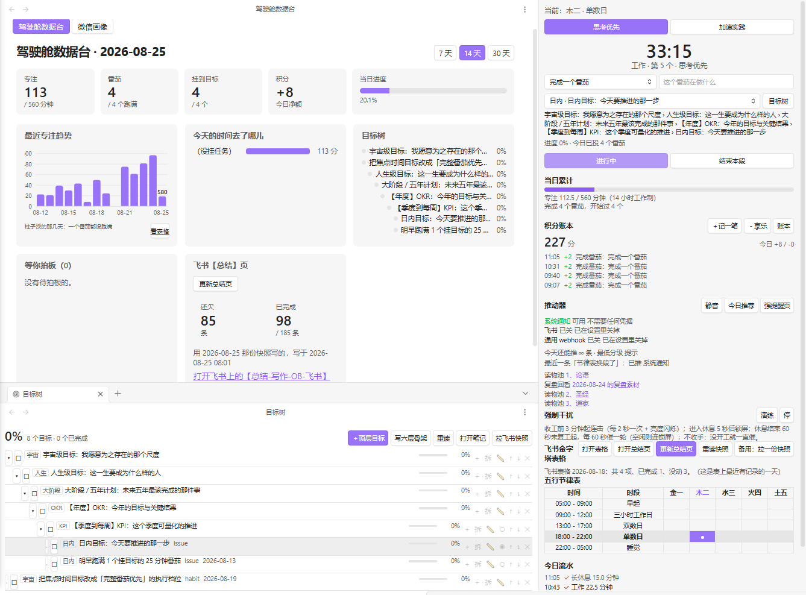
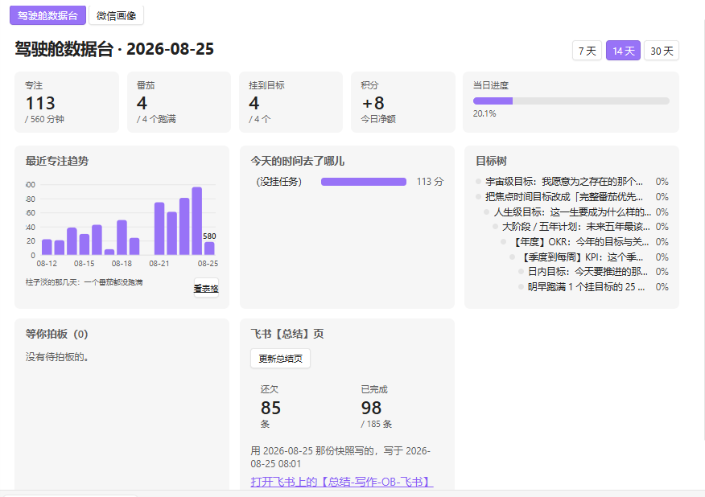
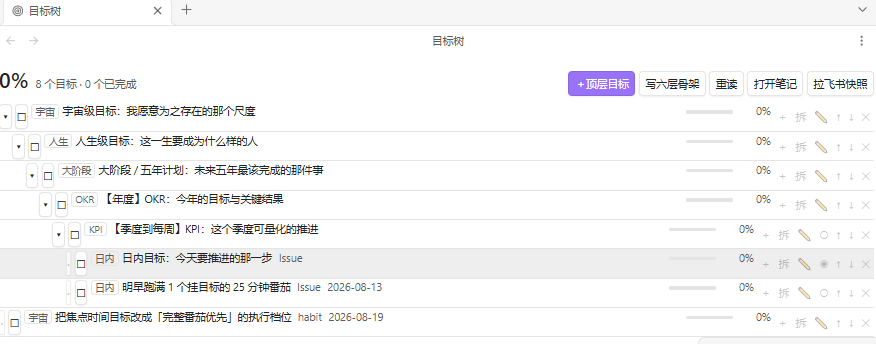
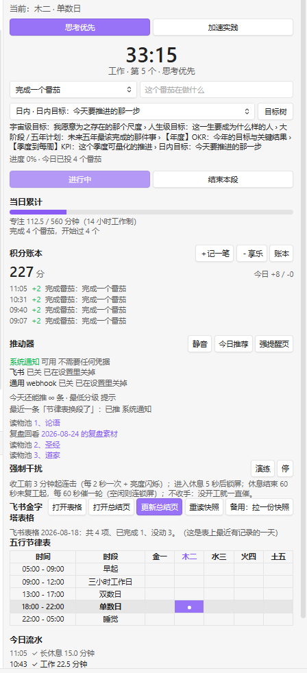
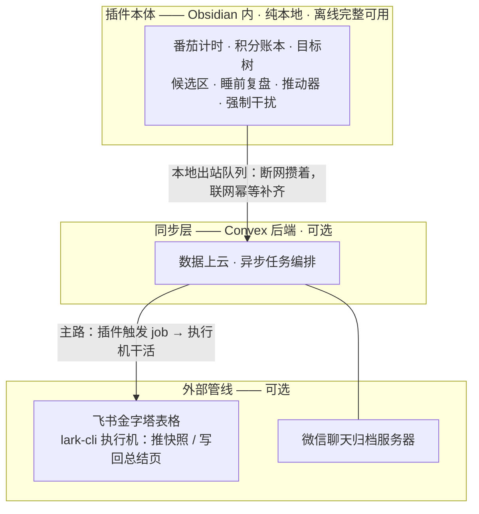
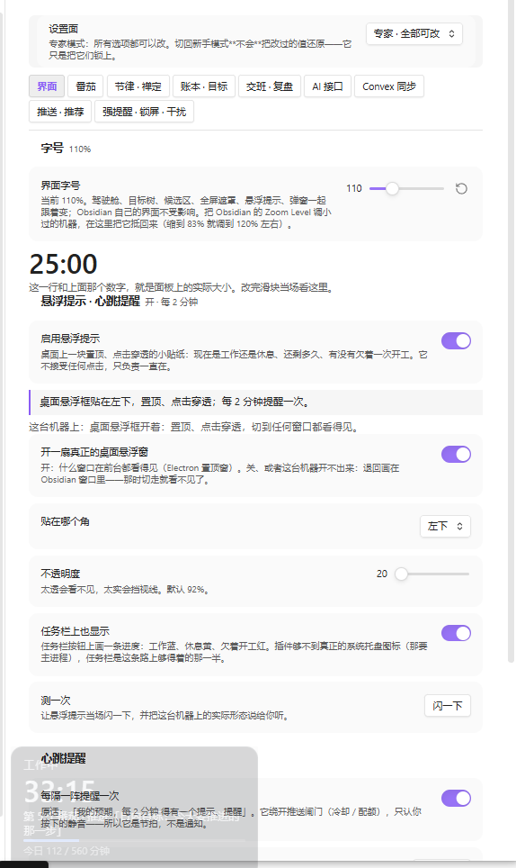

<h1>人生驾驶舱 · Life Cockpit</h1>

**把日记模板里画出来的那张作息表，跑成一个真的会打断你的 Obsidian 插件。**

<a href="#60-秒看懂">60 秒看懂</a> ·
<a href="#三分钟装上">三分钟装上</a> ·
<a href="#大白话讲一遍">大白话讲一遍</a> ·
<a href="#三条取舍">三条取舍</a> ·
<a href="#架构">架构</a> ·
<a href="#路线图">路线图</a> ·
<a href="#仓库地图">仓库地图</a> ·
<a href="#工程形态">工程形态</a> ·
<a href="#常见问题">常见问题</a>

> **别的番茄钟到点了会响一声。**
>
> 这一个到点了会连着弹通知、把屏幕亮度闪起来、在你确实离开时把电脑锁掉，然后接着催 —— 直到你回来亲手按下【开工】。
>
> 而且它记的每一分钟都是真的：**你离开的那段时间，一秒都不算。**

 
真实运行截图，未作美化 —— 左上「驾驶舱数据台」、左下六层目标树、右侧常驻驾驶舱

---

## 60 秒看懂

它的起点是一张画在日记模板里的作息表：五列对应五种日子，旁边写着「14 小时工作制、560 分钟番茄、25+5」。

**表画得再好也不会执行。** 它不会在下午三点提醒你现在该干什么，也不知道你今天到底专注了多少分钟。于是它被做成了一个插件。

跑起来之后，真正的难题才露出来：**一个替人记账的系统，第一件事是保证账是真的。** 人离开电脑的那段时间不能算专注，电脑休眠的三小时不能虚报成时长，界面上说的和它实际做的必须是同一件事 —— 账一旦假了，这套系统教人的就不是自律，而是自欺。

**整个插件的脾气，都是从这一句长出来的。**

### 你可能以为它是……

| 你可能以为 | 其实 |
| --- | --- |
| 又一个番茄钟 | 番茄只是八根轴里的第一根。它还管积分账本、六层目标树、AI 交班拍板、睡前复盘 |
| 一个习惯打卡 App | 它不打卡，它**记账** —— 而且账必须是真的：你离开的时间一秒不算，撤销一笔要写反向单、原始记录留痕 |
| 要连服务器才能用 | **纯本地，离线完整可用。** 后端是给它加翅膀的地方，从来不是它的腿 |
| 一个会温柔提醒你的小助手 | 它会连击、会闪屏、会锁屏，**默认不收手** |
| 数据锁在某个数据库里 | 全部落在你 vault 里的 Markdown / JSON，人能直接读、直接改、直接双链 |

### 适合谁

**✅ 适合** —— 已经在用 Obsidian 记日记或做 GTD，但「表画得再好也执行不下去」的人；相信账必须是真的、讨厌自欺式打卡的人；想读一份把二十多轮取舍原样写下来的中文工程文档的人。

**❌ 不适合** —— 手机党（`isDesktopOnly: true`，移动端装不上）；想要一个温柔番茄钟的人（这个会锁你屏）；不用 Obsidian 的人。

 
驾驶舱数据台 —— 今天的五个数字、近两周的专注趋势、待拍板队列与飞书【总结】页回执

---

## 三分钟装上

**三条路，任选一条：**

| 方式 | 怎么做 |
| --- | --- |
| **BRAT**（推荐） | 装 BRAT 插件 → `Add Beta Plugin` → 填 `AIGC-Builder-Club/obsidian-life-cockpit` |
| **手动** | 从 [Releases](https://github.com/AIGC-Builder-Club/obsidian-life-cockpit/releases/latest) 下载 `main.js`、`manifest.json`、`styles.css`，放进 vault 的 `.obsidian/plugins/life-cockpit/`，重载 Obsidian |
| **从源码构建** | `cd plugins/life-cockpit && npm ci && npm test && npm run build` |

装好之后启用 **Life Cockpit 人生驾驶舱**，第一次打开会弹一屏三问（数据放哪儿、用哪档节奏、界面新手还是专家）—— 都能跳过，之后随时在设置里改。

**新手推荐的三个答案**：文件夹留默认 `LifeCockpit/`、节奏选**思考优先**（25+5）、界面留**新手 · 开箱即用**。

> 📖 **20 分钟零后端跑通第一个番茄** —— 从装上到记第一笔积分、建第一棵目标树，一步一步：**[`快速上手.md`](plugins/life-cockpit/docs/快速上手.md)**
>
> 不想点鼠标？仓库里放了一份 [`data.beginner.json`](plugins/life-cockpit/docs/data.beginner.json) —— 它不是编出来的样例，是仓库主人日常在用的那份配置脱敏之后放进来的，一百多项**被真实调过**的参数。

**前提两条**：桌面端（不支持移动端）、Obsidian **1.6.6 或更高**。

---

## 大白话讲一遍

这一节是写给**完全没用过这类工具的人**的：不用术语，每个功能先打个比方，再说它到底做了什么、你会在屏幕上看到什么。八根轴，八段。

### 1 · 番茄计时 —— 回答「现在该干什么」

**大白话**：一个约定 —— 接下来 25 分钟只干一件事，时间到了强制休息 5 分钟，然后再来一轮。

> **打个比方**：像跑步机。上去之前先设好「跑 25 分钟」，跑起来之后它就不再问你累不累。

**它多做了什么**：两档节奏可选（**思考优先** 25+5、**加速实践** 45+10）；可以开「间歇节奏」—— 单数轮跑满基准时长、双数轮减半，长休息不缩水；休息段会盖一页全屏禅定休息页（工作段默认**不盖**，工作时你得看得见别的窗口）；还有一张五行节律表，按星期几映射到金一 / 木二 / 水三 / 火四 / 土五，到点提醒你换段。

**最关键的一条**：休息的钟到点自己走，**工作的钟永远停着等人按**。「自动开始下一段」这个开关在这个插件里被整个删掉了 —— 理由见下面〈[三条取舍](#三条取舍)〉。

**你会看到**：状态栏常驻一行 `33:15 · 工作 · 第 5 个 · 今日 112/560 分钟 · 227 分`。

### 2 · 积分账本 —— 回答「我今天到底挣了多少」

**大白话**：给自己开一个户头。做完该做的事记一笔**进账**，刷视频打游戏记一笔**出账**，余额就是你今天对自己的交代。

> **打个比方**：像记账 App，只不过币种不是钱。

**它多做了什么**：跑满一个番茄自动入账（默认 2 分，**手动结束的那一段不计分**）；别的事手工记一笔。每一笔都能撤销，而**撤销是写一笔方向相反的反向单，原始那笔留在账上** —— 不做静默删除。任务和分值不在设置页里维护，而在 vault 的一篇 `积分任务表.md` 里，你自己改。

**账落在哪儿**：`LifeCockpit/积分账本/2026-08.md`，一个月一份 Markdown，在 Obsidian 里直接能翻、能搜、能双链。

**为什么是 Markdown 不是数据库**：因为十年后你还打得开它。

### 3 · 六层目标树 —— 回答「这一个番茄，到底在给什么做贡献」

**大白话**：把「我这辈子想成为什么样的人」一层层拆到「今天下午要推进的那一步」，一共六层：

> 宇宙级 → 人生级 → 大阶段 / 五年计划 → 【年度】OKR → 【季度到每周】KPI → 日内目标

**打个比方**：像一棵倒过来长的树。上面是你不会轻易改的那句话，下面是今天能勾掉的那一格。

**它多做了什么**：番茄可以**挂**到具体的日内目标或 KPI 上 —— 挂上之后，「这条目标今天投了几个番茄」是**算出来**的，不是你估的。勾掉一个日内目标，完成度**向上回灌**，上面几层跟着往前动。

**这棵树是什么**：一篇你能直接读改的 `LifeCockpit/目标树.md`。缩进决定层级，行尾 `^g-1` 是节点号（忘了写会自动补），`[进度:: 42%]` 是算出来的（改它没有意义）。

**六层不用一次建满**：命令面板跑一次「写出目标树」，先拿到一份六层骨架，再改成你自己的话；只想先要两层也完全能用。

 
目标树面板 —— 每一层都能就地拆分、编辑、排序；进度是回灌上来的

### 4 · 夜班候选区 —— 回答「AI 干的活，凭什么直接改我的东西」

**大白话**：AI 晚上帮你写的东西，先进一个「待拍板」的收件箱，**不直接落进你的正文**。第二天你一条条看：采纳、打回，或者改写。

> **打个比方**：像编辑部的待审稿筐。稿子写好先进筐，主编点头才上版面。

**为什么非得这样**：一个能直接改你笔记的 AI，只要错一次，你就再也不敢让它跑第二次了。中间隔一道拍板，它错了你打回就是，成本是零。

**打回的理由会被记下来** —— 所以「AI 和人的每一次交接」在这个系统里都是有据可查的；采纳之后按类型分派到该去的地方，不丢。

**你会看到**：数据台上一格「等待拍板（0）」，有货的时候在那儿点开逐条处理。

### 5 · 睡前复盘 —— 回答「今天到底怎么样」

**大白话**：到点了，它把今天的番茄、积分、目标自动汇总成一份素材，交给 AI 出一份草稿，草稿进候选区等你拍板；你点头之后，结论回写进当天的日记、目标树和错题本。

> **打个比方**：像下班前的交接班日志。差别是前半段已经替你写好了，你只负责签字和改。

**三件事先说清**：素材是**取数算出来的**，不用你自己翻三个地方；AI 出不来草稿会退回兜底文案，并且**明说这是兜底**，不糊弄；**复盘本身不记账** —— 它只是回顾，不给自己发分。

**AI 接口是全局的一层**：一份可增删的档位表（OpenAI 兼容），密钥自己填或走环境变量；每一次调用的请求与返回都**只在本机留痕**（不进公开仓库、密钥不入日志、默认留 7 天）。

### 6 · 推动器 —— 回答「Obsidian 没开着的时候，谁来提醒我」

**大白话**：把提醒推出 Obsidian 窗口之外 —— 系统通知、飞书、或者你自己的 webhook。

> **打个比方**：像会走到客厅来喊你吃饭的那个人，而不是厨房里响了没人听见的定时器。

**它为什么不吵**：所有推送都要先过**五道闸** —— 总开关、渠道开关、分级（低于你设的最低分级不推）、免打扰时段（默认 22:00–05:00）、每日配额（默认 24 条）。**闸门写在推送之前，不是推完了再后悔。**

**开箱即用的那一档**：系统通知渠道默认就是开的，**不需要任何凭据**；飞书和通用 webhook 默认关着，要填地址才用得上。

**还有一页强提醒**：休息结束、准备复工之前先拦你一页 —— 上面写着当前该推进的目标、表上今天安排了什么、以及今天轮到的那本推荐读物（**点得开**，是真的内链）。

### 7 · 强制干扰 —— 回答「我要是不听呢」

**大白话**：那它就来真的。

> **打个比方**：像健身房里那个不接受「今天算了」的教练。

**默认的阶梯**（全部可调、可关）：

- 收工前 **3 分钟**起，通知连击，每 2 秒一次，同时**屏幕亮度缓速闪烁**；
- 进入休息 **5 秒**后锁屏；
- 休息结束 **60 秒**还没复工，每 60 秒催一轮，**机器空闲才强制锁屏**（你正在别处敲键盘就不锁）；
- **默认不收手**：没开工就一直催。

**三条硬规矩**：锁屏是唯一不可逆的动作，所以它只在机器确实空闲时才发生；每一轮催促都留痕；面板上任何时候都答得出「它下一步要干什么」。

**做不到的会明说**：亮度闪烁走 Windows 的 WMI，调不动就直说调不动；Linux 上没有统一的系统级锁屏，插件不假装自己有。

**想验一遍不用干等**：命令面板跑「演练一次强制干扰（20 秒）」，20 秒走完全套动静。

### 8 · 存在感 —— 回答「我切到别的窗口去了，它还在吗」

**大白话**：桌面角落一块小贴纸，一直贴着，告诉你现在是工作还是休息、还剩多久、有没有欠着一次开工。

> **打个比方**：像车里那块永远亮着的仪表盘。你不用一直低头看，但它一直在。

**细节**：那块贴纸**点击穿透** —— 鼠标点它会直接点到它后面的窗口上，它只负责显示，不抢你的操作；任务栏按钮上还有一条进度（工作蓝 / 休息绿 / 欠着开工红）；默认每 2 分钟心跳提醒一次。

**它不会比 Obsidian 活得久**：退出 Obsidian 时它自己关，开窗前会扫掉上一次留下的孤儿窗；插件被强杀，它几分钟后也自己消失。

 
右侧常驻驾驶舱 —— 一屏之内：计时、当日累计、积分流水、推动器状态、强制干扰阶梯、五行节律表

### 另外两根可选的轴

接了多两栏东西，**不接一个字都不少**：

- **飞书金字塔表格** —— 把飞书上那张任务表接进来一栏：强提醒页、面板和复盘素材里都能看到「今天表上安排了什么、做完没有」；反过来，「哪些做了、哪些没做」由后端整页写回**飞书那张表自己的【总结】页**，而不是在 Obsidian 里再画一份对不上的清单。主路要 Convex 后端 + 一台执行机（阶段三 / 四）；旁路是手动放一份快照 JSON，零依赖但属降级方案。
- **秒哒「5 分钟写作」** —— ⚠️ 目前是**作者自用**：接法是通的，但另一头那个应用没有对外开放，第三方拿不到能用的接口地址。两条将来能走通的路写在 [`可选模块.md`](plugins/life-cockpit/docs/可选模块.md) 第一节。

---

## 三条取舍

给想看门道的人。二十多轮取舍的完整记录在 [`docs/人生驾驶舱-LifeCockpit.md`](docs/人生驾驶舱-LifeCockpit.md)（65 KB，中文），这里挑三条讲清楚这个作品的脾气。

### 《开工永远是手动的》

作者的原话：「【开工】永远是人类手动的行为（【自动开工】永远是无法被接受的！）」

于是「自动开始下一段」那个开关面临两个选项：改成默认关闭，或者删掉。**选了删掉。** 理由有二 —— 改默认值救不回已经把「开」存进配置文件的那台机器；更要紧的是，**一个能被打开的自动开工开关，迟早会被打开**。

从那天起，休息的钟一到点就走，工作的钟永远停着等人；面板上只剩「开工」和「结束」两颗按钮，「暂停」连状态机里的入口都没有。

### 《重启是家常便饭》

作者是那种会频繁重启 Obsidian 的人，所以「重启就清空」不是简洁，是每天丢好几次状态。

真正难的还不是存下来，而是判断**离开的那段时间算不算专注**：全算，关机三小时回来白得三小时；全不算，重启一次二十秒、番茄从头来 —— 两头都是在造假。

最后的规矩按段的性质分：**工作段**给五分钟宽限期，超过就就地冻住、离开的时间一秒不算，回来自己按开工；**休息段**按墙上的钟走，人不在正好是在休息。

这条线背后是一句贯穿全项目的原则：**账假了，比状态丢了严重得多。**

### 《报告不另出一份，写回表自己身上》

「哪些做了、哪些没做」这种周报式的问题，最顺手的做法是在插件里再画一张漂亮的清单。**这里反着做**：由后端把结果整页写回飞书那张表自己的【总结】页，让答案长在数据本身身上 —— 不开 Obsidian 也看得到，不连后端也看得到。

原因很朴素：**同一份事实画两遍，迟早出现两份对不上的清单，而对不上的两份比只有一份坏得多。** 插件这一侧因此只多了一条「打开总结页」的路，没有副本。

---

## 架构

**往下每一层都是可选的。**

拔掉外部管线，同步层照跑；同步层整个挂掉，插件还是照跑 —— 番茄、遮罩、强制干扰、往笔记库落盘，一样不少。断网期间要上行的数据攒在本地的**出站队列**里，联网之后按内容对账补齐，**不会重、不会丢**。

**后端是这个插件加翅膀的地方，从来不是它的运行时依赖。**

---

## 路线图

这个作品分四个阶段开放。这不是弃坑，是按「能让人真的用起来」的顺序放：

| 阶段 | 内容 | 状态 |
| --- | --- | --- |
| **一 · 看得懂** | 全部源码、605 条测试与设计文档公开；本 README 就是给你读的 | ✅ 已交付 |
| **二 · 装得上** | Release 三件套 + BRAT，打 tag 自动发版，不用再手动拷文件 | ✅ 已通（社区插件市场尚未提交） |
| **三 · 后端** | 开放同步层（Convex）的部署方式：跨设备同步、飞书写回调度自己搭 | 🚧 进行中 |
| **四 · 服务器** | 外部管线服务器侧（飞书导出执行机、微信归档服务器）部署样例 | 🚧 计划中 |

当前版本 **0.19.0**，桌面端。

---

## 仓库地图

| 路径 | 里面是什么 |
| --- | --- |
| [`plugins/life-cockpit/`](plugins/life-cockpit/) | 插件源码、605 条回归用例、构建配置 |
| [`plugins/life-cockpit/README.md`](plugins/life-cockpit/README.md) | 插件视角的说明：八根轴、设计取舍、工程形态 |
| [`plugins/life-cockpit/docs/快速上手.md`](plugins/life-cockpit/docs/快速上手.md) | **20 分钟零后端跑通第一个番茄** |
| [`plugins/life-cockpit/docs/使用手册.md`](plugins/life-cockpit/docs/使用手册.md) | 全量手册：命令面板清单、每一种落盘格式、每一条行为边界 |
| [`plugins/life-cockpit/docs/可选模块.md`](plugins/life-cockpit/docs/可选模块.md) | 飞书金字塔表格 / 秒哒的接法与门槛 |
| [`plugins/life-cockpit/docs/data.beginner.json`](plugins/life-cockpit/docs/data.beginner.json) | 脱敏后的真实配置，可直接放进 vault |
| [`dist/life-cockpit/`](dist/life-cockpit/) | 安装三件套 `main.js` / `manifest.json` / `styles.css`（与 Release assets 同源） |
| [`docs/人生驾驶舱-LifeCockpit.md`](docs/人生驾驶舱-LifeCockpit.md) | 设计取舍全记录，二十多轮，65 KB |
| [`docs/飞书金字塔表格-快照约定.md`](docs/飞书金字塔表格-快照约定.md) | 快照 JSON 的格式约定 |

---

## 工程形态

社区朋友会关心的部分：

- **TypeScript + esbuild**，标准 Obsidian 插件形态（`manifest.json` + `main.js`）。
- **605 条纯逻辑回归用例**跑在 Node 自带的 test runner 上（`node --test`），外加 eslint。
- `src/core/` 是纯逻辑层，**不许 `import "obsidian"`**，也不碰 Node 内建模块 —— 计时状态机、时段判定、落盘幂等这些核心逻辑，在没有 Obsidian 的裸机器上就能测。
- 整个插件**只有一个文件**（`src/desktop.ts`）碰 Electron / Node 能力，而且是懒加载：拿不到就明说拿不到，不让插件挂掉。
- **凭据只有两处来源**（设置页、环境变量），**仓库里一处都不留**；粘进来的 key 会先洗一遍（空白、引号、`Bearer ` 前缀全自动去掉），框下面只显示形状（是不是 JWT、多少字符），不回显密钥。
- **写盘幂等**：内容没变就不写盘。
- 设置面分**新手 · 开箱即用**与**专家 · 全部可改**两档；新手档下大部分项是「灰着只读」而不是「藏起来」—— 你看得见它存在，只是现在不让你改。

 
设置面 —— 两档、八个标签页；左下角那块是桌面上点击穿透的悬浮提示

---

## 常见问题

**移动端能用吗？** 不能。`isDesktopOnly: true`，这一条不会变 —— 强制干扰、锁屏、悬浮窗都要 Electron / 系统能力。

**一定要连后端吗？** 不用。照着[快速上手](plugins/life-cockpit/docs/快速上手.md)跑起来的**不是阉割版，是完整的单机体验**。

**它会把我的数据传走吗？** 不会。插件不内置任何密钥，也不自己往外发东西；只有你亲手填了地址的渠道（飞书 / webhook / AI 接口）才会有出站请求。

**数据存在哪儿？** 你 vault 里的 `LifeCockpit/`（首次运行可以改到别处）—— 番茄流水、积分账本、目标树、候选区、复盘日记全在下面，都是人能直接读改的 Markdown / JSON。

**560 分钟 / 14 小时是硬性的吗？** 不是。**那是标尺，不是 KPI**，设置里按你自己的作息改。

**Linux 上功能全吗？** 计时、账本、目标树、复盘、系统通知全都一样；**系统级锁屏和亮度闪烁做不到** —— 手册里明说了做不到，而不是装作做到了。

**为什么没有「暂停」按钮？** 见〈[三条取舍](#三条取舍)〉第一条。面板上只有「开工」和「结束」。

**记错一笔积分怎么办？** 命令面板跑「撤销最近一笔积分」，它写一笔反向单，原始那笔留在账上。

---

## License · 致谢 · 反馈

- **许可证**：本仓库整体以 **[AGPL-3.0-only](LICENSE)** 发布 —— 源码、测试、文档与安装产物同属一个 license。
- **致谢**：工程形态承袭 [Easy-Git-Maintained](https://github.com/hanshou101/Easy-Git-Maintained)；「内容没变就不写盘」的幂等写法源自 RefBake 的实践；地基站在 Obsidian、Electron、esbuild、Convex 与 Node.js 测试生态上。
- **反馈**：欢迎提 [GitHub Issues](https://github.com/AIGC-Builder-Club/obsidian-life-cockpit/issues)。装的过程中卡住了、觉得哪一段读不懂，都算 —— 读不懂本身就是个 bug。

---

**Life Cockpit** · An Obsidian desktop plugin that actually interrupts you.

Pomodoro timing with honest accounting (time away never counts), a reversible points ledger in plain Markdown, a six-level goal tree with upward progress roll-up, an approval queue for overnight AI output, a bedtime review pipeline, and a nudge system that escalates from notifications to screen-brightness flashing to a real lock screen. Fully local and offline-capable — the optional Convex backend gives it wings, never legs. Desktop only, Obsidian ≥ 1.6.6, AGPL-3.0-only.

中文文档为主 · Documentation is primarily in Chinese

