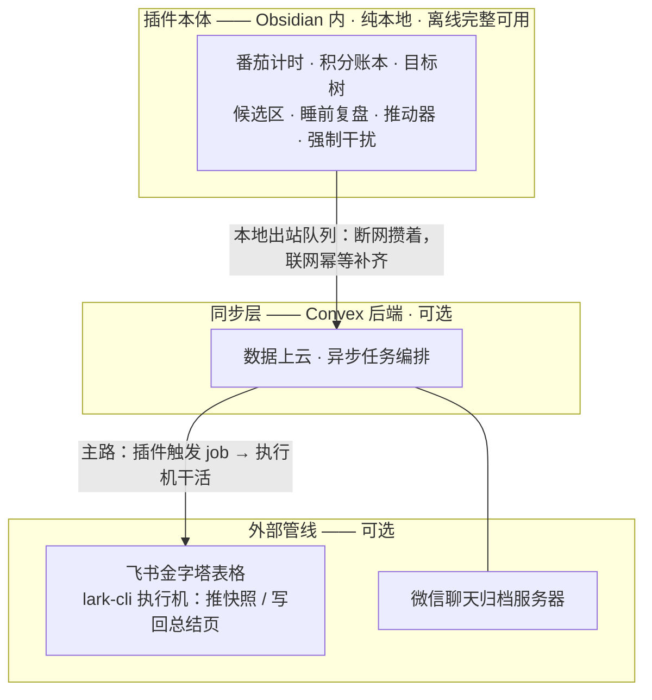

# 人生驾驶舱 Life Cockpit

**把日记模板里画出来的作息表，跑成一个真的会打断你的驾驶舱。**

一个只做桌面端的 Obsidian 插件，纯本地运行，离线完整可用。

插件的数据默认落在笔记库里的 `LifeCockpit/` 文件夹（首次运行时可以选别处）；本页与手册里出现的作者个人目录，只是他自己 vault 的布局——装上之后都能在设置里改。

> 🏠 **想先看这个作品是什么、长什么样：[仓库首页 README](../../README.md)**——那里有截图、大白话讲的八根轴、安装与路线图。
>
> 📖 **完整用法在 [`docs/使用手册.md`](docs/使用手册.md)**——安装步骤、命令面板全部清单、每一种落盘格式、每一条行为边界，都在那份手册里。本页只回答三个问题：这是什么、为什么做成这样、现在做到了哪一步。

## 为什么会有它

那张作息表原本画在日记模板里：五列对应五种日子，旁边写着「14 小时工作制、560 分钟番茄、25+5」。表画得再好也不会执行——它不会提醒你现在该干什么，也不知道你今天到底专注了多少分钟。

把它跑起来之后，真正的难题才露出来：**一个替人记账的系统，第一件事是保证账是真的。** 人离开电脑的那段时间不能算专注，电脑休眠的几小时不能虚报成时长，界面上说的和它实际做的必须是同一件事——账一旦假了，这套系统教人的就不是自律，而是自欺。

## 架构：往下每一层都是可选的

**往下每一层都是可选的**：拔掉外部管线，同步层照跑；同步层整个挂掉，插件还是照跑——番茄、遮罩、强制干扰、往笔记库落盘，一样不少。断网期间要上行的数据攒在本地的出站队列里，联网之后按内容对账补齐，不会重、不会丢。后端是这个插件加翅膀的地方，从来不是它的运行时依赖。

## 八根轴

所有功能都挂在这八根轴上：

- **时间 · 番茄计时** —— 思考优先 25+5、加速实践 45+10 两档节奏，当日 14 小时 / 560 分钟的进度常驻状态栏。
  <!-- 截图：驾驶舱面板 · 番茄与当日进度 -->
- **状态 · 积分账本** —— 完成任务入账、享乐出账，每笔可撤销且撤销留痕，一个月一份 Markdown 落进笔记库，随时可翻可搜。
  <!-- 截图：积分账本月页 -->
- **结构 · 目标树** —— 从宇宙级到日内的六层目标，向下拆分、完成度向上回灌，整棵树是人可直接读改的一篇 Markdown。
  <!-- 截图：目标树面板 -->
- **交班 · 候选区** —— 夜里 AI 干完的活先落候选区、不直接改正文，白天逐条采纳 / 打回 / 改写——AI 和人的每一次交接都有拍板记录。
  <!-- 截图：候选区拍板面 -->
- **收口 · 睡前复盘** —— 到点自动汇总当天的番茄、积分、目标成一份素材，AI 出草稿投进候选区，人拍板后回写日记、目标树与错题本。
  <!-- 截图：睡前复盘草稿 -->
- **推动 · 推动器** —— 把提醒推出 Obsidian 窗口之外（系统通知 / 飞书 / webhook，分级、可静音、有免打扰时段和每日配额），复工之前先拦一页强提醒页。
  <!-- 截图：复工强提醒页 -->
- **打断 · 强制干扰** —— 人不听的时候来真的：收工前通知连击、屏幕亮度缓速闪烁、机器空闲才锁屏；每一轮催促都留痕，面板答得出「它下一步要干什么」。
  <!-- 截图：强制干扰演练 -->
- **存在感 · 悬浮提示** —— 桌面一块点击穿透的小贴纸、任务栏一条进度、默认每 2 分钟一次心跳提醒——人切去别的窗口干活时，这套系统依然在场。
  <!-- 截图：桌面悬浮贴纸与心跳 -->

## 三个设计取舍

给想看门道的人。二十多轮取舍的完整记录见 [`../../docs/人生驾驶舱-LifeCockpit.md`](../../docs/人生驾驶舱-LifeCockpit.md)，这里挑三条讲清楚这个作品的脾气。

### 《开工永远是手动的》

作者的原话：「【开工】永远是 人类手动的行为（【自动开工】永远是无法被接受的！）」于是「自动开始下一段」那个开关面临的选项有两个：改成默认关闭，或者删掉。选了删掉，理由有二——改默认值救不回已经把「开」存进配置文件的那台机器；更要紧的是，**一个能被打开的自动开工开关，迟早会被打开**。从那天起，休息的钟一到点就走，工作的钟永远停着等人；面板上只剩「开工」和「结束」两颗按钮，「暂停」连状态机里的入口都没有。

### 《重启是家常便饭》

作者是那种会频繁重启 Obsidian 的人，所以「重启就清空」不是简洁，是每天丢好几次状态。真正难的还不是存下来，而是判断**离开的那段时间算不算专注**：全算，关机三小时回来白得三小时；全不算，重启一次二十秒、番茄从头来——两头都是在造假。最后的规矩按段的性质分：工作段给五分钟宽限期，超过就就地冻住、离开的时间一秒不算，回来自己按开工；休息段按墙上的钟走，人不在正好是在休息。这条线背后是一句贯穿全项目的原则：**账假了比状态丢了严重得多。**

### 《报告不另出一份，写回表自己身上》

「哪些做了、哪些没做」这份周报式的问题，最顺手的做法是在插件里再画一张漂亮的清单。这里反着做：由后端脚本把结果整页写回飞书那张表自己的【总结】页，让答案长在数据本身身上——不开 Obsidian 也看得到，不连后端也看得到。原因很朴素：**同一份事实画两遍，迟早出现两份对不上的清单，而对不上的两份比只有一份坏得多。** 插件这一侧因此只多了一条「打开总结页」的路，没有副本。

## 现在能玩到什么程度

这个作品分四个阶段开放，这不是弃坑：

1. **阶段一（现在）· 看得懂** —— 全部源码、测试与设计文档就在这个仓库里，本篇 README 就是给你读的。当前版本 0.19.0，桌面端。
2. **阶段二 · 装得上** —— 已通：Release 三件套 + BRAT（`AIGC-Builder-Club/obsidian-life-cockpit`），打 tag 自动发版，不用再手动拷贝三个文件；社区插件市场尚未提交。
3. **阶段三 · 后端** —— 开放同步层（Convex 后端）的部署方式，跨设备同步与飞书写回调度可以自己搭。
4. **阶段四 · 服务器** —— 外部管线（飞书导出执行机、微信归档服务器）的服务器侧部署样例。

在此之前，如果你想亲手跑起来：**20 分钟零后端跑通第一个番茄，见 [`docs/快速上手.md`](docs/快速上手.md)**；完整的手动安装与构建步骤在[手册](docs/使用手册.md)里。

## 工程形态

社区朋友会关心的部分：

- TypeScript + esbuild 打包，标准 Obsidian 插件形态（`manifest.json` + `main.js`）。
- **605 条纯逻辑回归用例**跑在 Node 自带的 test runner 上（`node --test`），外加 eslint。
- `src/core/` 是纯逻辑层，**不许 import "obsidian"**，也不碰 Node 内建模块——计时状态机、时段判定、落盘幂等这些核心逻辑在没有 Obsidian 的裸机器上就能测。
- 整个插件只有一个文件（`src/desktop.ts`）碰 Electron / Node 能力，而且是懒加载：拿不到就明说拿不到，不让插件挂掉。

## 许可证 · 致谢 · 反馈

- 许可证：本仓库（源码、测试、文档与安装产物）整体以 [AGPL-3.0-only](../../LICENSE) 发布。
- 致谢：工程形态承袭 [Easy-Git-Maintained](https://github.com/hanshou101/Easy-Git-Maintained)；「内容没变就不写盘」的幂等写法源自 RefBake 的实践；地基站在 Obsidian、Electron、esbuild、Convex 与 Node.js 测试生态上。
- 反馈：欢迎提 [GitHub Issues](https://github.com/AIGC-Builder-Club/obsidian-life-cockpit/issues)。
